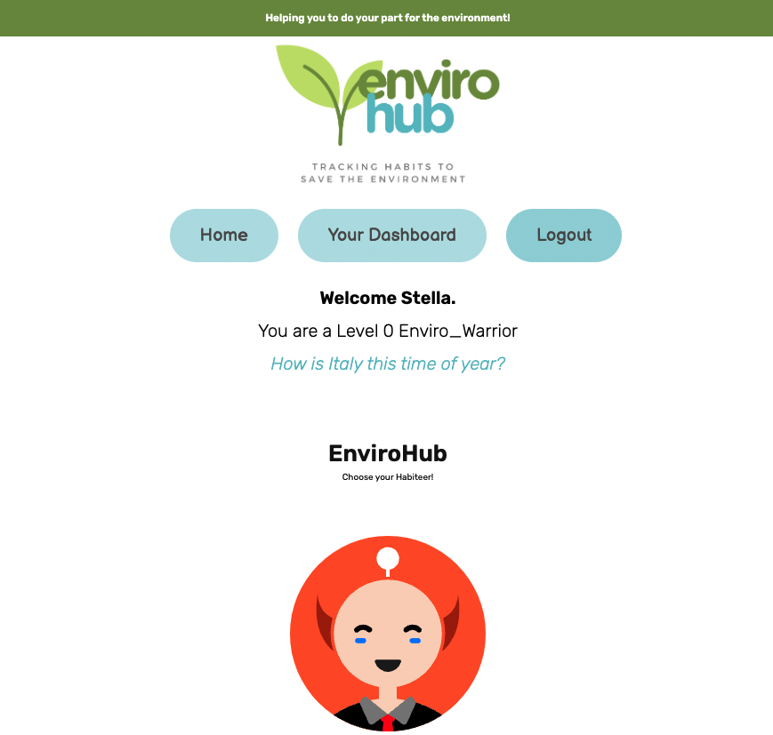

# EnviroHub

## Description
EnviroHub is a web application designed to help users create new habits that benefit their local environment and personal health.
## Table of Contents
- [Instation Instructions](#installation-instructions)
- [Usage Instructions](#usage-instructions)
- [Repository Link](#repository-link)
- [Hosted Link](#hosted-link) 
- [References](#references)

## Installation Instructions
 1. Clone our repository to your local device
 2. Open in VS code
 3. Open the integrated terminal within the server.js location
 4. Enter "npm -init -y" to initialise npm
 5. Enter "npm i" to install packages
 6. Update the fields inside the .env file and remove .EXAMPLE from the file name
 7. Enter "mysql -u root -p", login to mysql and source database/schema.sql; then quit mysql
 8. Run "npm start" to create all tables and initialise the server
 9. Run "npm run watch" to access the live server
 

## Usage Instructions

Upon entry to EnviroHub, you will be met with a page displaying an interactive map of all our user's. To join, simply click 'login' and fill in the required fields to create your new account. Returning users will only have to enter their email and password. Once you're in, you will be able to choose from a list of green and eco-friendly habits which you will commit to completing over the course of a 21 day cycle. "It only takes 21 days for a new habit to set in!" Every day you will have the option to select the checkbox on the habits you have completed which will progress you through the levels of EnviroHub. Do you have what it takes to become the ultimate Enviro Warrior

## License
This project is created under the MIT license

## Credits
This project was created by the EnviroHub team
[samw1s3](https://github.com/samw1s3)
[lev8947](https://github.com/lev8947)
[kirstens25](https://github.com/kirstens25)
[kieranmichaelflynn](https://github.com/kieranmichaelflynn)

## Questions
To find out more information about this repo please visit our github page [here!](https://github.com/lev8947/Technicolor-Project-2.git)

Thank you for reading, enjoy EnviroHub!
